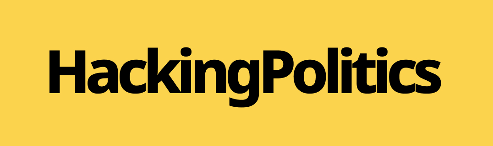

# Hacking Politics Frontend

<div style="text-align:center">
<a href="https://upstatement.com/timber/"></a>
</div>

By
[Norbert Rost](https://github.com/norbertrost) ([@Zukunftsstadtde](https://twitter.com/Zukunftsstadtde)),
[Jakob Schumann](https://github.com/j-schumann),
[Pauline Grahlmann](https://github.com/pascalknecht),
[Tina Hoffmann](https://github.com/palmiak),
[Philipp Munzert](https://github.com/philmuze) ([@philmuze](https://twitter.com/philmuze)),
[Frieder Jacobi](https://github.com/f-jacobi)

[](https://app.netlify.com/sites/hacking-politics/deploys)

---

## Installation

```bash
# install dependencies
$ yarn install

# serve with hot reload at localhost:3000
$ yarn dev

# build for production and launch server
$ yarn build
$ yarn start

# generate static project
$ yarn generate
```

For detailed explanation on how things work, check out [Nuxt.js docs](https://nuxtjs.org).

## Configuration

If the software is configurable, describe it in detail, either here or in other documentation to which you link.

## Usage

Show users how to use the software.
Be specific.
Use appropriate formatting when showing code snippets.

---

## Mission Statement

With Hacking Politics we want to provide further access to the democratic system.

## Support

To get help it is best to [open](https://github.com/HackingPolitics/hp-frontend/issues) an issue for the project.

## Getting involved

This section should detail why people should get involved and describe key areas you are
currently focusing on; e.g., trying to get feedback on features, fixing certain bugs, building
important pieces, etc.

General instructions on _how_ to contribute should be stated with a link to [CONTRIBUTING](CONTRIBUTING.md).

## Documentation

The Official Documenation for the project is work in progress and will be linked here.

## Credits and references

1. Projects that inspired you
2. Related projects
3. Books, papers, talks, or other sources that have meaningful impact or influence on this project

## Supported by

The project is a finalist of the [PrototypeFund Round 9](https://prototypefund.de/projects/round-9/ 'Prototypefund Website'), see https://prototypefund.de/project/hackingpoliticsonline/ for details.

[](https://www.bmbf.de/de/software-sprint-freie-programmierer-unterstuetzen-3512.html 'BMBF Software Sprint Förderrichtlinie')
[](https://prototypefund.de 'Prototypefund Website')
